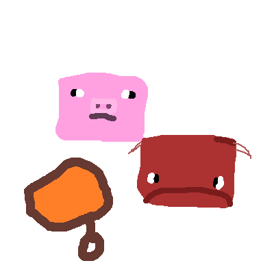

# Unsaddle

**Unsaddle** is a very small mod that hat allows the player to remove saddles from animals without having to kill them unmercifully. Sneak + rightclick a saddled animal (Strider or Pig) to retrieve its saddle.

Continuation of alkyaLy's [Unsaddleeeee](https://web.archive.org/web/20211202230803/https://www.curseforge.com/minecraft/mc-mods/unsaddleeeee) mod.
